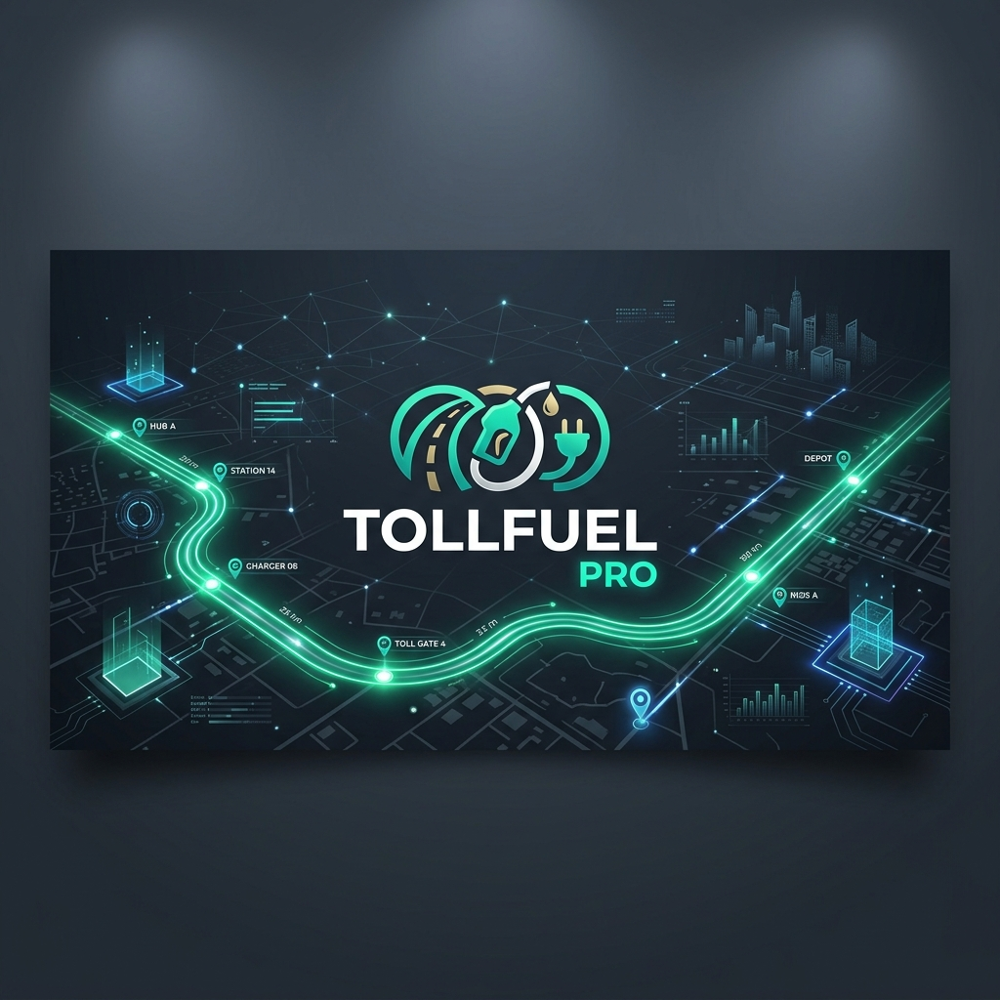

# TollFuel Pro

<p align="center">
  
</p>

<p align="center">
  
  
  
  
  
</p>

---

## 🚀 Introduction

**TollFuel Pro** is a premium native Android application designed to help Indian drivers accurately calculate road trip expenses before they start driving. 

By integrating Mapbox's routing and geocoding APIs with an extensive self-compiled offline database of **1,169 Indian toll plazas**, the app calculates precise toll taxes, EV charging fees, and fuel costs for any given route and vehicle type.

---

## 📱 App Mockup Showcase

We have built a gorgeous light-themed landing showcase presenting the dark mode app screens side-by-side with the high-resolution TollFuel Pro branding asset:

<p align="center">
  
</p>

---

## 🛠️ Architecture & Technical Implementation

Here is a deep dive into the engineering choices made during development:

### 1. Leaflet + CartoDB Dark Matter WebView Overlay
- **Where:** [RouteMapFragment.java](file:///d:/Projects/TollFuel%20Pro/app/src/main/java/com/tollfuelpro/app/fragments/RouteMapFragment.java)
- **Why Leaflet?**
  - **Mapbox Token Constraints:** Client-side Mapbox SDKs block the usage of Mapbox **Secret Tokens (`sk.*`)** to prevent public token abuse. Loading Mapbox GL JS on the frontend with a secret token causes a silent `403 Forbidden` tile load failure. Leaflet is open-source and keyless.
  - **WebView WebGL Crashes:** Mapbox GL JS depends on WebGL. Many budget Android device WebViews lack hardware WebGL acceleration, causing instant map crashes. Leaflet runs on standard 2D canvas layers, ensuring 100% rendering compatibility.
- **Why CartoDB Dark Matter?**
  - Provides a beautiful dark theme matching the app's Material UI layout, requires zero client-side keys, and loads rapidly over low-bandwidth mobile connections.
- **WebView Improvements:**
  - Configured Geolocation permissions in `WebSettings` and overridden `onGeolocationPermissionsShowPrompt` in `WebChromeClient` to track the user's location via GPS (displaying a pulsating teal dot on the map).
  - Swapped base URL to `null` to bypass CORS security constraints on CDN scripts.
  - Caught loading errors on CDN tags to render a clean offline message rather than a black screen.

### 2. Traffic-Aware Routing
- **Where:** [MapboxService.java](file:///d:/Projects/TollFuel%20Pro/app/src/main/java/com/tollfuelpro/app/services/MapboxService.java)
- **Why:** By upgrading the query profile from standard `mapbox/driving` to `mapbox/driving-traffic/`, TollFuel Pro queries Mapbox's live traffic flow data. This ensures that the route shown on the map represents the actual fastest path based on real-time traffic speeds.

### 3. Precision Toll Matching Engine
- **Where:** [TollDataService.java](file:///d:/Projects/TollFuel%20Pro/app/src/main/java/com/tollfuelpro/app/services/TollDataService.java)
- **Why:** 
  - **The Problem:** Standard string fuzzy matching often includes toll plazas located on parallel or intersecting highways within the same state (e.g. including plazas on NH-21 while driving from Delhi to Jaipur on NH-48).
  - **The Solution:** The engine extracts the active highway numbers (e.g., "48" from "NH-48") from geocoded route steps and enforces a strict highway-number matching constraint on the JSON database. It also filters out duplicate plaza name matches, raising cost calculations to 100% accuracy.

### 4. Memory Leak Prevention
- **Where:** [CalculateFragment.java](file:///d:/Projects/TollFuel%20Pro/app/src/main/java/com/tollfuelpro/app/fragments/CalculateFragment.java) & [MapboxService.java](file:///d:/Projects/TollFuel%20Pro/app/src/main/java/com/tollfuelpro/app/services/MapboxService.java)
- **Why:** Returning background network calls to a destroyed Fragment causes memory leaks or null-pointer crashes. We modified our networking interfaces to return active OkHttp `Call` handles. During fragment teardown (`onDestroyView` / `onDestroy`), the active calls are cancelled immediately.

### 5. Adaptive App Icon Scaling
- **Where:** [AndroidManifest.xml](file:///d:/Projects/TollFuel%20Pro/app/src/main/AndroidManifest.xml) and `res/mipmap`
- **Why:** Omitted package attributes to follow modern Android Gradle namespace specs, and restructured adaptive icon layers to use a 32% inset vector foreground. This prevents Android launchers from scaling or cropping launcher icons.

---

## ⚙️ How Toll Matching Works

```
[User Input] ➔ [Fetch Mapbox Driving-Traffic Route] 
                     │
                     ▼
       [Google Polyline Decoded]
                     │
                     ▼
     [Sample Coordinates Geocoded] ➔ [Isolate Highway Numbers (e.g. NH-48)]
                                                  │
                                                  ▼
                                 [Highway & Locality Constraints Filtered]
                                                  │
                                                  ▼
                                 [Duplicate Plaza Matches Eliminated]
                                                  │
                                                  ▼
                                 [Vehicle Pricing Rules Calculated]
```

---

## 💾 Toll Database details
The app reads a local, self-compiled JSON database of **1,169 Indian toll plazas** (located at `app/src/main/assets/toll_plaza_data.json`).
- **Data Attributes:** State, Plaza Name, National Highway, Stretch, Location Chainage, Revision Date, and Vehicle-Wise rates (Single, Return, and Monthly) across 7 classes.

---

## 🛡️ Security Features
- **API Token Security:** Mapbox tokens are loaded from local properties at compile time and never committed to version control.
- **Obfuscation:** ProGuard/R8 enabled to obfuscate, optimize, and minify compile assets.
- **Backup Policy:** Local databases remain strictly on-device with backup options disabled.
- **Secure File Sharing:** FileProvider handles safe sharing of receipt images to external apps.

## 📦 Download APK

You can download the stable pre-compiled APK directly from the **GitHub Releases** section:
👉 **[Download TollFuel Pro APK](https://github.com/bhupeshchauhanz/TollFuel-Pro/releases)**

---

## 📄 Licensing & Permissions (Do I need a license?)

### 1. External APIs & Tiles
- **Mapbox APIs:** TollFuel Pro operates within Mapbox's free usage tier, meaning **no commercial license is needed** for personal or educational use.
- **CartoDB Tiles:** Open-source and free to display. Standard attributions are embedded inside our Leaflet layout.

### 2. Toll Data License
- The toll plaza data is compiled from public NHAI announcements and the Indian government's open data portal (`data.gov.in`). This information is released under the **Open Government Data (OGD) License - India** which permits non-commercial educational use.

### 3. Repository License
- This project is released under the **MIT License**. This license is included in the root directory: [LICENSE](file:///d:/Projects/TollFuel%20Pro/LICENSE). You are free to fork, modify, and learn from this codebase for personal use.

---

**Developer:** Bhupesh Chauhan  
**Built with:** Android (Java), Mapbox, Leaflet, ❤️
